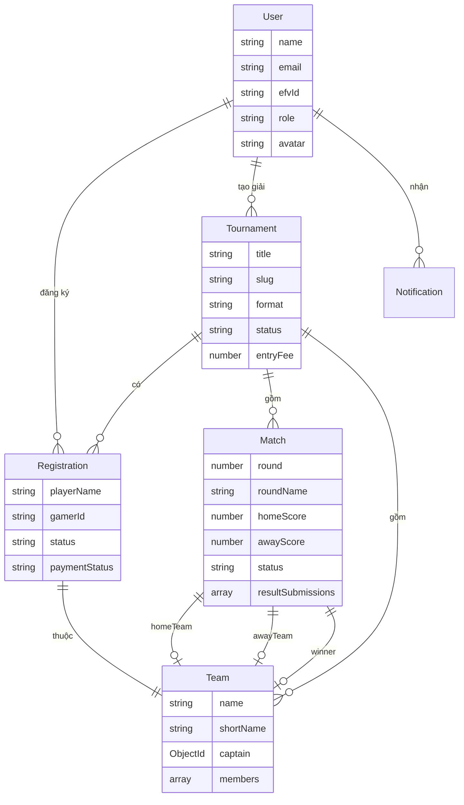

# ⚽ eFootCup VN — Nền tảng Quản lý Giải đấu eFootball

<p align="center">
  
</p>

<p align="center">
  <strong>Nền tảng quản lý giải đấu eFootball chuyên nghiệp hàng đầu Việt Nam</strong><br/>
  Tổ chức — Đăng ký — Thanh toán — Thi đấu — Kết quả — Tất cả trong một
</p>

<p align="center">
  
  
  
  
  
  
</p>

---

## 📌 Giới thiệu

**eFootCup VN** là nền tảng trực tuyến giúp cộng đồng eFootball tại Việt Nam dễ dàng tổ chức, quản lý và tham gia các giải đấu — từ nghiệp dư đến chuyên nghiệp. Hệ thống tự động hóa toàn bộ quy trình: đăng ký, thanh toán, bốc thăm, lập sơ đồ thi đấu, gửi kết quả, và thống kê.

## 🚀 Tính năng chính

### 🏆 Quản lý Giải đấu (Manager)

| Tính năng | Mô tả |
|---|---|
| **Tạo giải đấu** | Tùy chỉnh thể thức (Loại trực tiếp, Vòng tròn), luật chơi, giải thưởng, banner |
| **Quản lý đăng ký** | Duyệt/từ chối VĐV, xem chi tiết thông tin, xuất Excel danh sách |
| **Tự động bốc thăm** | Tạo bracket theo chuẩn seeding chuyên nghiệp (byes, power-of-2) |
| **Lịch thi đấu** | Quản lý lịch trình, trạng thái trận đấu, cập nhật tỉ số |
| **Xem kết quả VĐV gửi** | Icon 👁 mở popup xem tỉ số + ảnh minh chứng VĐV đã gửi |
| **Xuất PDF** | Tải lịch thi đấu bản in chuyên nghiệp |
| **BXH & Thống kê** | Bảng xếp hạng, thống kê bàn thắng, phong độ đội |
| **Báo cáo** | Dashboard tổng quan giải đấu |

### 🎮 Người chơi (User)

| Tính năng | Mô tả |
|---|---|
| **Hồ sơ cá nhân (EFV-ID)** | Mã định danh duy nhất, avatar, thông tin cá nhân |
| **Đăng ký giải đấu** | Form thông minh với tỉnh/huyện/xã Việt Nam, DatePicker chính xác |
| **Thanh toán tự động** | Tích hợp PayOS, quét VietQR, xác nhận webhook realtime |
| **Lịch thi đấu cá nhân** | Xem trận sắp tới, trận đã đấu trên trang cá nhân |
| **Gửi kết quả trận đấu** | Upload tỉ số + ảnh minh chứng (tối đa 3), gửi 1 lần rồi khóa |
| **Thông báo** | Nhận thông báo qua website khi có thay đổi giải đấu |

### 👑 Quản trị hệ thống (Admin)

| Tính năng | Mô tả |
|---|---|
| **Dashboard** | Thống kê tổng quan: user, giải đấu, bài viết, doanh thu |
| **Quản lý người dùng** | Xem, phân quyền, quản lý tài khoản |
| **Quản lý bài viết** | Rich text editor (TipTap), quản lý danh mục tin tức |
| **Cấu hình thanh toán** | Thiết lập cổng PayOS (Client ID, API Key, Checksum) |
| **Cài đặt hệ thống** | Logo, favicon, SEO, social links, maintenance mode |
| **Menu & Navigation** | Quản lý menu navbar/footer linh hoạt |

## 🔄 Quy trình Gửi & Duyệt kết quả

```
┌──────────────────────────────────────────────────────────────┐
│                     FLOW GỬI KẾT QUẢ                        │
├──────────────────────────────────────────────────────────────┤
│                                                              │
│  [VĐV] Trang cá nhân → Gửi kết quả (tỉ số + ảnh + note)    │
│    ↓                                                         │
│  [API] Xác thực → Check team → $push vào resultSubmissions   │
│    ↓                                                         │
│  [VĐV] Hiện "Đã gửi kết quả — chờ quản lý duyệt" 🔒        │
│    ↓                                                         │
│  [Manager] Thấy icon 👁 → Click xem submissions              │
│    ↓                                                         │
│  [Manager] Xem tỉ số + ảnh minh chứng → Nhập tỉ số chính    │
│    ↓                                                         │
│  [VĐV] Hiện "Kết quả chính thức" 🔒 Đã khóa                │
│                                                              │
└──────────────────────────────────────────────────────────────┘
```

## 🛠 Công nghệ sử dụng

### Core Stack
- **Framework**: [Next.js 16](https://nextjs.org/) (App Router, Server Components)
- **UI Library**: [React 19](https://react.dev/)
- **Language**: [TypeScript 5](https://www.typescriptlang.org/)
- **Styling**: [Tailwind CSS 4](https://tailwindcss.com/)
- **Animation**: [Framer Motion 12](https://www.framer.com/motion/)

### Backend & Database
- **API**: Next.js API Routes (Serverless Functions)
- **Database**: [MongoDB](https://www.mongodb.com/) + [Mongoose 9](https://mongoosejs.com/)
- **Authentication**: JWT (jsonwebtoken) + Bcryptjs
- **File Storage**: Local filesystem (`/uploads`) + API serving

### Thanh toán & Tích hợp
- **Payment Gateway**: [PayOS](https://payos.vn/) (VietQR, webhook verification)
- **Email**: [Nodemailer](https://nodemailer.com/)

### UI Components & Utilities
- **Icons**: [Lucide React](https://lucide.dev/)
- **Rich Editor**: [TipTap](https://tiptap.dev/) (bài viết, tin tức)
- **PDF Export**: [jsPDF](https://github.com/parallax/jsPDF) + jsPDF-AutoTable
- **Excel**: [SheetJS (xlsx)](https://sheetjs.com/) — Import/Export danh sách VĐV
- **Date Picker**: [React Day Picker](https://react-day-picker.js.org/)
- **UI Primitives**: [Radix UI](https://www.radix-ui.com/) + [shadcn/ui](https://ui.shadcn.com/)
- **Toast**: [Sonner](https://sonner.emilkowal.dev/)

## 📦 Cấu trúc dự án

```
efootcup/
├── app/
│   ├── (auth)/                    # 🔐 Đăng nhập, Đăng ký
│   ├── (main)/                    # 🌐 Trang công khai
│   │   ├── page.tsx               #     Trang chủ
│   │   ├── giai-dau/              #     Danh sách & chi tiết giải đấu
│   │   ├── tin-tuc/               #     Tin tức eFootball
│   │   ├── bxh/                   #     Bảng xếp hạng
│   │   └── trang-ca-nhan/         #     Hồ sơ cá nhân + lịch thi đấu
│   ├── (manager)/manager/         # 🏟️ Quản lý giải đấu (BTC)
│   │   ├── giai-dau/[id]/         #     Chi tiết giải: đăng ký, lịch, sơ đồ, BXH
│   │   ├── tao-giai-dau/          #     Tạo giải đấu mới
│   │   ├── vdv/                   #     Quản lý vận động viên
│   │   ├── bxh/                   #     Bảng xếp hạng giải
│   │   ├── thong-ke/              #     Thống kê
│   │   └── bao-cao/               #     Báo cáo
│   ├── (admin)/admin/             # 👑 Quản trị hệ thống
│   │   ├── nguoi-dung/            #     Quản lý user
│   │   ├── bai-viet/              #     Quản lý bài viết & danh mục
│   │   ├── giai-dau/              #     Quản lý giải đấu
│   │   ├── thanh-toan/            #     Quản lý thanh toán
│   │   ├── menu/                  #     Quản lý menu
│   │   └── cai-dat/               #     Cài đặt hệ thống
│   └── api/                       # ⚡ REST API Endpoints
│       ├── auth/                  #     Đăng ký, đăng nhập, profile, participation
│       ├── tournaments/           #     CRUD giải đấu, brackets, matches, submit-result
│       ├── payment/               #     PayOS create, verify, webhook
│       ├── posts/                 #     CRUD bài viết
│       ├── upload/                #     Upload file
│       └── ...                    #     Notifications, BXH, Settings, Menus
├── components/
│   ├── ui/                        #     Shadcn UI components (Button, Dialog, Input...)
│   ├── sections/                  #     Homepage sections (Hero, Features, CTA...)
│   ├── Navbar.tsx                 #     Navigation bar (responsive, mega menu)
│   └── Footer.tsx                 #     Footer
├── contexts/
│   └── AuthContext.tsx             #     Global authentication state
├── hooks/
│   └── useConfirmDialog.tsx        #     Confirmation dialog hook
├── lib/
│   ├── mongodb.ts                 #     Database connection
│   ├── auth.ts                    #     JWT helpers, middleware (requireAuth, requireManager, requireAdmin)
│   ├── api.ts                     #     Client-side API helpers
│   └── utils.ts                   #     Utility functions
├── models/                        # 📊 Mongoose Schemas
│   ├── User.ts                    #     Người dùng (EFV-ID, role, avatar)
│   ├── Tournament.ts              #     Giải đấu (format, rules, prizes)
│   ├── Registration.ts            #     Đăng ký (thông tin, team, payment status)
│   ├── Team.ts                    #     Đội (captain, members, stats)
│   ├── Match.ts                   #     Trận đấu (score, events, resultSubmissions)
│   ├── Post.ts                    #     Bài viết (TipTap content)
│   ├── PaymentConfig.ts           #     Cấu hình thanh toán PayOS
│   ├── SiteSettings.ts            #     Cài đặt website
│   ├── Notification.ts            #     Thông báo
│   ├── Bxh.ts                     #     Bảng xếp hạng
│   └── ...                        #     Category, Feedback, SiteMenu, Counter
├── public/                        # 🖼️ Static assets
├── scripts/                       # 🔧 Migration scripts
└── uploads/                       # 📁 User-uploaded files
```

## ⚙️ Cài đặt & Chạy dự án

### Yêu cầu

- **Node.js** >= 18.x
- **MongoDB** (local hoặc MongoDB Atlas)
- **PayOS Account** (cho tính năng thanh toán)

### 1. Clone repository

```bash
git clone https://github.com/phamkhoa18/efootcup.git
cd efootcup
```

### 2. Cài đặt dependencies

```bash
npm install
```

### 3. Cấu hình biến môi trường

Tạo file `.env.local`:

```env
# Database
MONGODB_URI=mongodb+srv://your_connection_string

# Authentication
JWT_SECRET=your_jwt_secret_key

# App URL
NEXT_PUBLIC_APP_URL=http://localhost:3000

# PayOS Payment Gateway
PAYOS_CLIENT_ID=your_payos_client_id
PAYOS_API_KEY=your_payos_api_key
PAYOS_CHECKSUM_KEY=your_payos_checksum_key

# Email (Nodemailer - Gmail App Password)
EMAIL_USER=your_email@gmail.com
EMAIL_PASS=your_app_password
```

### 4. Chạy Development Server

```bash
npm run dev
```

Truy cập [http://localhost:3000](http://localhost:3000)

### 5. Build Production

```bash
npm run build
npm start
```

## 🗄️ Database Models



## 🔒 Phân quyền hệ thống

| Role | Quyền |
|---|---|
| **User** | Đăng ký giải, xem lịch, gửi kết quả, quản lý hồ sơ |
| **Manager** | Tạo/quản lý giải đấu, duyệt đăng ký, cập nhật tỉ số, xem kết quả VĐV |
| **Admin** | Toàn quyền hệ thống: user, bài viết, thanh toán, cài đặt website |

## 📱 API Endpoints chính

```
AUTH
  POST   /api/auth/register          Đăng ký tài khoản
  POST   /api/auth/login             Đăng nhập
  GET    /api/auth/me                Thông tin user hiện tại
  GET    /api/auth/me/participation   Lịch sử thi đấu cá nhân

TOURNAMENTS
  GET    /api/tournaments             Danh sách giải đấu (phân trang)
  POST   /api/tournaments             Tạo giải đấu mới
  GET    /api/tournaments/[id]        Chi tiết giải đấu
  POST   /api/tournaments/[id]/brackets   Tạo sơ đồ thi đấu
  GET    /api/tournaments/[id]/brackets   Lấy brackets + matches
  POST   /api/tournaments/[id]/matches/submit-result   VĐV gửi kết quả

PAYMENT
  POST   /api/tournaments/[id]/pay    Tạo link thanh toán PayOS
  POST   /api/payment/payos-webhook   Webhook xác nhận thanh toán

ADMIN
  GET    /api/admin/stats             Thống kê dashboard
  CRUD   /api/posts                   Quản lý bài viết
  CRUD   /api/admin/users             Quản lý người dùng
```

## 📈 SEO & Performance

- ✅ **Server Components** — Pre-render nội dung cho SEO
- ✅ **Dynamic Metadata** — Title, description tự động theo từng trang
- ✅ **Sitemap.xml** & **Robots.txt** — Tự động cập nhật
- ✅ **Image Optimization** — `next/image` với lazy loading
- ✅ **Code Splitting** — Tự động bởi Next.js App Router

## 🎨 Screenshots

> Thêm ảnh demo các trang chính tại đây

## 📄 License

Dự án thuộc bản quyền của đội ngũ phát triển eFootCup VN.

---

<p align="center">
  <strong>⚽ eFootCup VN</strong> — Nơi kết nối cộng đồng eFootball Việt Nam<br/>
  Thiết kế và phát triển bởi <a href="https://github.com/phamkhoa18">Phạm Đăng Khoa</a>
</p>
